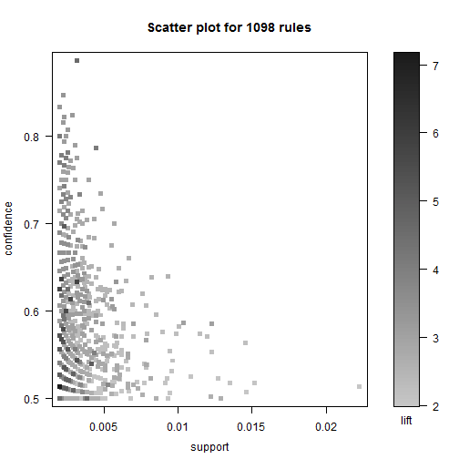

关联分析挖掘购买行为的关联性
========================================================

## 关联分析的基本概念
### 项集

### 关联规则
记为`X->Y`的形式，称关联规则左侧的项集X为先决条件，右侧项集Y为相应的关联结果

### 评价关联性强弱
- 支持度(`Support`)
- 置信度(`Confidence`)
- 提升度(`Lift`)

## 关联分析基本算法步骤
1. 选出满足支持度最小阈值的所有项集，即`频繁项集`
2. 从频繁项集中找出满足最小置信度的所有规则

## 相关算法 `Apriori`和`Eclat`

R实现
=========================================

加载相应软件包`arules`

```r
## install.packages("arules")
library(arules)
```

案例数据集

```r
data("Groceries")
summary(Groceries)
```

```
## transactions as itemMatrix in sparse format with
##  9835 rows (elements/itemsets/transactions) and
##  169 columns (items) and a density of 0.02609 
## 
## most frequent items:
##       whole milk other vegetables       rolls/buns             soda 
##             2513             1903             1809             1715 
##           yogurt          (Other) 
##             1372            34055 
## 
## element (itemset/transaction) length distribution:
## sizes
##    1    2    3    4    5    6    7    8    9   10   11   12   13   14   15 
## 2159 1643 1299 1005  855  645  545  438  350  246  182  117   78   77   55 
##   16   17   18   19   20   21   22   23   24   26   27   28   29   32 
##   46   29   14   14    9   11    4    6    1    1    1    1    3    1 
## 
##    Min. 1st Qu.  Median    Mean 3rd Qu.    Max. 
##    1.00    2.00    3.00    4.41    6.00   32.00 
## 
## includes extended item information - examples:
##        labels  level2           level1
## 1 frankfurter sausage meet and sausage
## 2     sausage sausage meet and sausage
## 3  liver loaf sausage meet and sausage
```

```r
inspect(Groceries[1:10])
```

```
##    items                     
## 1  {citrus fruit,            
##     semi-finished bread,     
##     margarine,               
##     ready soups}             
## 2  {tropical fruit,          
##     yogurt,                  
##     coffee}                  
## 3  {whole milk}              
## 4  {pip fruit,               
##     yogurt,                  
##     cream cheese ,           
##     meat spreads}            
## 5  {other vegetables,        
##     whole milk,              
##     condensed milk,          
##     long life bakery product}
## 6  {whole milk,              
##     butter,                  
##     yogurt,                  
##     rice,                    
##     abrasive cleaner}        
## 7  {rolls/buns}              
## 8  {other vegetables,        
##     UHT-milk,                
##     rolls/buns,              
##     bottled beer,            
##     liquor (appetizer)}      
## 9  {pot plants}              
## 10 {whole milk,              
##     cereals}
```

支持度最小阈值设为0.01
置信度最小阈值设为0.5

```r
rules0 <- apriori(data = Groceries,
                  parameter = list(support = 0.001,
                                   confidence = 0.5))
```

```
## 
## parameter specification:
##  confidence minval smax arem  aval originalSupport support minlen maxlen
##         0.5    0.1    1 none FALSE            TRUE   0.001      1     10
##  target   ext
##   rules FALSE
## 
## algorithmic control:
##  filter tree heap memopt load sort verbose
##     0.1 TRUE TRUE  FALSE TRUE    2    TRUE
## 
## apriori - find association rules with the apriori algorithm
## version 4.21 (2004.05.09)        (c) 1996-2004   Christian Borgelt
## set item appearances ...[0 item(s)] done [0.00s].
## set transactions ...[169 item(s), 9835 transaction(s)] done [0.00s].
## sorting and recoding items ... [157 item(s)] done [0.00s].
## creating transaction tree ... done [0.00s].
## checking subsets of size 1 2 3 4 5 6 done [0.03s].
## writing ... [5668 rule(s)] done [0.00s].
## creating S4 object  ... done [0.00s].
```

```r
rules0 ##显示rules0中生成关联规则条数
```

```
## set of 5668 rules
```

## 动态调整阈值生成规则
支持度置信度控制

```r
rules1 <- apriori(data = Groceries,
                  parameter = list(support = 0.005,
                                   confidence = 0.5))
```

```
## 
## parameter specification:
##  confidence minval smax arem  aval originalSupport support minlen maxlen
##         0.5    0.1    1 none FALSE            TRUE   0.005      1     10
##  target   ext
##   rules FALSE
## 
## algorithmic control:
##  filter tree heap memopt load sort verbose
##     0.1 TRUE TRUE  FALSE TRUE    2    TRUE
## 
## apriori - find association rules with the apriori algorithm
## version 4.21 (2004.05.09)        (c) 1996-2004   Christian Borgelt
## set item appearances ...[0 item(s)] done [0.00s].
## set transactions ...[169 item(s), 9835 transaction(s)] done [0.00s].
## sorting and recoding items ... [120 item(s)] done [0.00s].
## creating transaction tree ... done [0.01s].
## checking subsets of size 1 2 3 4 done [0.00s].
## writing ... [120 rule(s)] done [0.00s].
## creating S4 object  ... done [0.00s].
```

```r
rules1
```

```
## set of 120 rules
```

支持度(置信度，提升度)控制

```r
rules.sorted_sup <- sort(rules0, by = "support") ## 按支持度排序
inspect(rules.sorted_sup[1:5]) ##Top 5关联规则
```

```
##   lhs                     rhs          support confidence  lift
## 1 {other vegetables,                                           
##    yogurt}             => {whole milk} 0.02227     0.5129 2.007
## 2 {tropical fruit,                                             
##    yogurt}             => {whole milk} 0.01515     0.5174 2.025
## 3 {other vegetables,                                           
##    whipped/sour cream} => {whole milk} 0.01464     0.5070 1.984
## 4 {root vegetables,                                            
##    yogurt}             => {whole milk} 0.01454     0.5630 2.203
## 5 {pip fruit,                                                  
##    other vegetables}   => {whole milk} 0.01352     0.5175 2.025
```


## 关联规则可视化
可视化包`arulesViz`

```r
## install.packages("arulesViz")
library(arulesViz)
```

Sample

```r
rules5 <- apriori(Groceries, parameter=list(support=0.002,
                                            confidence=0.5))
```

```
## 
## parameter specification:
##  confidence minval smax arem  aval originalSupport support minlen maxlen
##         0.5    0.1    1 none FALSE            TRUE   0.002      1     10
##  target   ext
##   rules FALSE
## 
## algorithmic control:
##  filter tree heap memopt load sort verbose
##     0.1 TRUE TRUE  FALSE TRUE    2    TRUE
## 
## apriori - find association rules with the apriori algorithm
## version 4.21 (2004.05.09)        (c) 1996-2004   Christian Borgelt
## set item appearances ...[0 item(s)] done [0.00s].
## set transactions ...[169 item(s), 9835 transaction(s)] done [0.02s].
## sorting and recoding items ... [147 item(s)] done [0.00s].
## creating transaction tree ... done [0.00s].
## checking subsets of size 1 2 3 4 5 done [0.00s].
## writing ... [1098 rule(s)] done [0.00s].
## creating S4 object  ... done [0.01s].
```

```r
rules5
```

```
## set of 1098 rules
```

```r
plot(rules5)
```

 

```r
## plot(rules5, interactive=TRUE) ## 互动散点图
```


