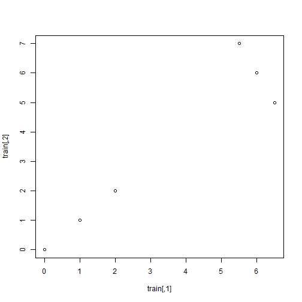

kNN
========================================

## advantages of kNN for classification are

- Very simple implementation
- Robust with regard to the search space; for instance, classes don't have to be linearly separable.
- Classifier can be updated online at very little cost as new instances with known classes are presented.
- Few parameters to tune: distance metric and k.

## disadvantages of the algorithm are

- Expensive testing of each instance, as we need to compute its distance to all known instances. Specialized algorithms and heuristics exist for specific problems and distance functions, which can mitigate this issue. This is problematic for datasets with a large number of attributes. When the number of instances is much larger than the number of attributes, a R-tree or a kd-tree can be used to store instances, allowing for fast exact neighbor identification.
- Sensitiveness to noisy or irrelevant attributes, which can result in less meaningful distance numbers. Scaling and/or feature selection are typically used in combination with kNN to mitigate this issue.
- Sensitiveness to very unbalanced datasets, where most entities belong to one or a few classes, and infrequent classes are therefore often dominated in most neighborhoods. This can be alleviated through balanced sampling of the more popular classes in the training stage, possibly coupled with ensembles.

## Algorithm Description
The training phase for kNN consists of simply storing all known instances and their class labels. A tabular representation can be used, or a specialized structure such as a kd-tree. If we want to tune the value of 'k' and/or perform feature selection, n-fold cross-validation can be used on the training dataset. The testing phase for a new instance 't', given a known set 'I' is as follows:
 1. Compute the distance between 't' and each instance in 'I'
 2. Sort the distances in increasing numerical order and pick the first 'k' elements
 3. Compute and return the most frequent class in the 'k' nearest neighbors, optionally weighting each instance's class by the inverse of its distance to 't'

## Case Study

### Data set

```r
# Class A cases 
A1=c(0,0)
A2=c(1,1)
A3=c(2,2)

# Class B cases
B1=c(6,6)
B2=c(5.5,7)
B3=c(6.5,5)

# Build the classification matrix
train=rbind(A1,A2,A3, B1,B2,B3)

# Class labels vector (attached to each class instance) 
cl=factor(c(rep("A",3),rep("B",3)))

# Plot
plot(train)
```

 

```r
# The object to be classified
# test=c(4, 4)
test = matrix (c(4,4,3,3,5,6,7,7), ncol=2, byrow=TRUE)
```


## R implemention for kNN

```r
# Load the class package that holds the knn() function 
library(class) 

# call knn() and get its summary
summary(knn(train, test, cl, k = 3))
```

```
## A B 
## 1 3
```

