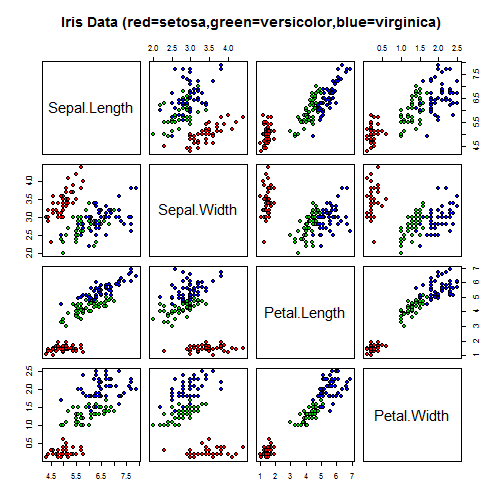

## Naïve Bayes


## Available packages on CRAN
`e1071` and `klaR`


```r
library(e1071)
library(RTextTools)
```

## 1. Iris Data Set
The Iris dataset contains 150 instances, corresponding to three equally-frequent species of iris plant (Iris setosa, Iris versicolour, and Iris virginica). An Iris versicolor is shown below, courtesy of Wikimedia Commons.


```r
summary(iris)
```

```
##   Sepal.Length   Sepal.Width    Petal.Length   Petal.Width 
##  Min.   :4.30   Min.   :2.00   Min.   :1.00   Min.   :0.1  
##  1st Qu.:5.10   1st Qu.:2.80   1st Qu.:1.60   1st Qu.:0.3  
##  Median :5.80   Median :3.00   Median :4.35   Median :1.3  
##  Mean   :5.84   Mean   :3.06   Mean   :3.76   Mean   :1.2  
##  3rd Qu.:6.40   3rd Qu.:3.30   3rd Qu.:5.10   3rd Qu.:1.8  
##  Max.   :7.90   Max.   :4.40   Max.   :6.90   Max.   :2.5  
##        Species  
##  setosa    :50  
##  versicolor:50  
##  virginica :50  
##                 
##                 
## 
```

```r
pairs(iris[1:4], main = "Iris Data (red=setosa,green=versicolor,blue=virginica)",
      pch = 21,
      bg = c("red", "green3", "blue")[unclass(iris$Species)])
```

 

## Classify use naive Bayes

```r
## column from 1 to 4 is the attributes, col 5 is the class
classifier <- naiveBayes(iris[ ,1:4], iris[,5])
## result
table(predict(classifier, iris[,-5]), iris[,5])
```

```
##             
##              setosa versicolor virginica
##   setosa         50          0         0
##   versicolor      0         47         3
##   virginica       0          3        47
```

This simple case study shows that a Naïve Bayes classifier makes few mistakes in a dataset that, although simple, is not linearly separable, as shown in the scatterplots and by a look at the confusion matrix, where all misclassifications are between Iris Versicolor and Iris Virginica instances.

## Note


## 2. 微博情感数据分析
1）载入数据

```r
happy <- readLines("./Data//happy.txt")
sad <- readLines("./Data//sad.txt")
happy_test <- readLines("./Data//happy_test.txt")
sad_test <- readLines("./Data//sad_test.txt")

tweet <- c(happy,sad)
tweet_test <- c(happy_test,sad_test)
tweet_all <- c(tweet,tweet_test)
sentiment <- c(rep("happy", length(happy) ), 
              rep("sad", length(sad)))
sentiment_test <- c(rep("happy", length(happy_test) ), 
                   rep("sad", length(sad_test)))
sentiment_all <- as.factor(c(sentiment, sentiment_test))
```

2）使用`RTextTools`包的`create_matrix`方法创建`document-term matrix`

```r
mat <- create_matrix(tweet_all, language="english", 
                   removeStopwords=FALSE, removeNumbers=TRUE, 
                        stemWords=FALSE, weighting=tm::weightTfIdf)
mat <- as.matrix(mat)
```

3）使用朴素贝叶斯训练模型

```r
classifier <- naiveBayes(mat[1:160,], as.factor(sentiment_all[1:160]))
pred <- predict(classifier, mat[161:180,])

table(sentiment_test,pred)
```

```
##               pred
## sentiment_test happy sad
##          happy     5   5
##          sad       3   7
```

```r
recall_accuracy(sentiment_test,pred)
```

```
## [1] 0.6
```

其他分类方法

```r
# the other methods
mat= create_matrix(tweet_all, language="english", 
                   removeStopwords=FALSE, removeNumbers=TRUE, 
                   stemWords=FALSE, tm::weightTfIdf)

container = create_container(mat, as.numeric(sentiment_all),
                             trainSize=1:160, testSize=161:180,
                             virgin=FALSE) #可以设置removeSparseTerms

models = train_models(container, algorithms=c("MAXENT",
                                              "SVM",
                                               #"GLMNET", "BOOSTING", 
                                               "SLDA","BAGGING", 
                                              "RF", # "NNET", 
                                              "TREE" 
                                               ))

# test the model
results = classify_models(container, models)

table(as.numeric(as.numeric(sentiment_all[161:180])), results[,"FORESTS_LABEL"])
```

```
##    
##      1  2
##   1 10  0
##   2  1  9
```

```r
recall_accuracy(as.numeric(as.numeric(sentiment_all[161:180])), results[,"FORESTS_LABEL"])
```

```
## [1] 0.95
```

```r
analytics = create_analytics(container, results)
summary(analytics)
```

```
## ENSEMBLE SUMMARY
## 
##        n-ENSEMBLE COVERAGE n-ENSEMBLE RECALL
## n >= 1                1.00              0.95
## n >= 2                1.00              0.95
## n >= 3                1.00              0.95
## n >= 4                1.00              0.95
## n >= 5                1.00              0.95
## n >= 6                0.95              1.00
## 
## 
## ALGORITHM PERFORMANCE
## 
##        SVM_PRECISION           SVM_RECALL           SVM_FSCORE 
##                0.955                0.950                0.950 
##       SLDA_PRECISION          SLDA_RECALL          SLDA_FSCORE 
##                0.955                0.950                0.950 
##    BAGGING_PRECISION       BAGGING_RECALL       BAGGING_FSCORE 
##                0.955                0.950                0.950 
##    FORESTS_PRECISION       FORESTS_RECALL       FORESTS_FSCORE 
##                0.955                0.950                0.950 
##       TREE_PRECISION          TREE_RECALL          TREE_FSCORE 
##                1.000                1.000                1.000 
## MAXENTROPY_PRECISION    MAXENTROPY_RECALL    MAXENTROPY_FSCORE 
##                0.955                0.950                0.950
```

